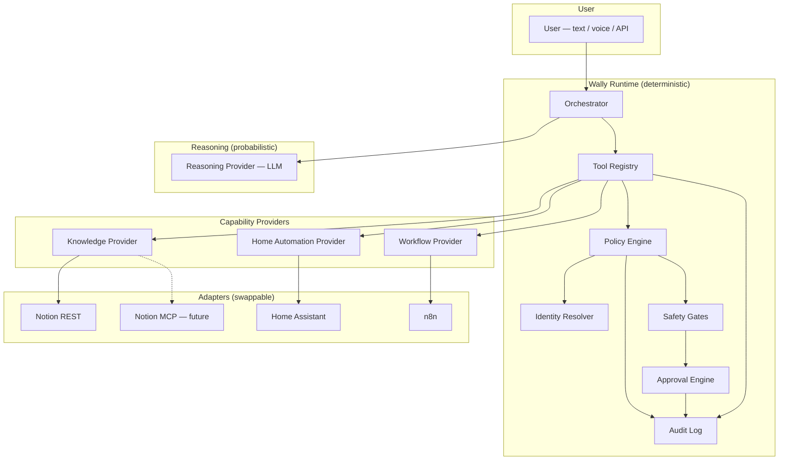

# Wally — Architecture Review v2

**Status:** Proposal — implemented in v0.3.1  
**Date:** 2026-06-27  
**Scope:** Align v0.3 codebase with platform governance philosophy before v0.4

---

## Executive summary

The v0.3 codebase is **well-aligned on provider isolation and deterministic safety gates**. It is **not yet aligned** on knowledge vocabulary, governance vs operational knowledge, execution identities, or a formal runtime policy layer.

**Recommendation:** One incremental refactor (v0.3.1) covering renames + governance policy. Defer execution identities until a second credential exists. Do not rewrite the orchestrator or Notion adapter logic.

---

## 1. Updated architecture diagram

### Platform view



### Request path (write action)

```
1. User message
2. Orchestrator → Reasoning Provider plans tool call
3. Tool Registry receives call
4. Policy Engine     → Layer 1: governance write? → REJECT (no provider call)
5. Safety Classifier → action risk class (read / reversible / destructive / …)
6. Safety Gates      → dry-run? approval required?
7. Approval Engine   → Layer 3: human confirm if needed
8. Identity Resolver → pick least-privilege credential for this action
9. Provider executes with that identity's credentials
10. Audit Log        → Layer 4: record outcome
11. Reasoning Provider composes response
```

**Key invariant:** Steps 4–10 never consult the LLM.

---

## 2. Alignment assessment — current vs v2 principles

| Principle | Current state | Aligned? |
|-----------|---------------|----------|
| Wally is a platform, LLM provides judgment | Provider pattern; `ToolRegistry` mediates execution | **Mostly yes** |
| Runtime enforces policy, not LLM | Rule-based `classifier.py` + `ApprovalGate` | **Yes** |
| Never trust prompts for security | ADR-005; gates are deterministic | **Yes** |
| Knowledge Provider (not Memory) | `MemoryProvider`, `memory_*` tools | **No** — rename needed |
| Knowledge Assets as first-class objects | `MemoryEntry` (page-shaped) | **Partial** — rename + `asset_type` |
| Governance vs operational distinction | Not implemented | **No** — policy engine needed |
| Defense in depth (4 layers) | Layers 3–4 exist; Layer 1 partial; Layer 2 config-only | **Partial** |
| Execution identities | Single `NOTION_API_KEY` | **No** — defer until needed |
| Providers expose capabilities | Protocols for LLM, memory, approval | **Yes** |
| HA as external provider | Designed, not built | **N/A** (v0.4) |
| Audit every write | Audit on tool execution | **Yes** |
| Orchestrator never thinks in Notion | Mostly true; health check says `notion` | **Mostly yes** |

### What already works (do not rewrite)

- `Orchestrator` reasoning loop + tool iteration
- `ToolRegistry` as execution boundary between LLM and providers
- `safety/classifier.py` — deterministic action classification
- `safety/gates.py` — approval + dry-run
- `ApprovalProvider` protocol + CLI adapter
- `audit/logger.py` — JSON Lines append-only log
- `adapters/notion/` isolated from orchestrator
- `SessionStore` for conversation history (separate from knowledge)

---

## 3. Recommended renames

### Capability domain

| Current | Proposed | Notes |
|---------|----------|-------|
| `MemoryProvider` | `KnowledgeProvider` | Protocol in `providers/knowledge.py` |
| `MemoryEntry` | `KnowledgeAsset` | `models/knowledge.py` |
| `MemorySearchResult` | `KnowledgeRetrievalResult` | |
| `NotionMemoryAdapter` | `NotionKnowledgeAdapter` | Adapter only |
| `create_memory_provider` | `create_knowledge_provider` | |
| `memory_enabled` | `knowledge_enabled` | Settings |
| `providers.memory` | `providers.knowledge` | Config YAML |

### Tools (LLM-facing — runtime vocabulary)

| Current | Proposed |
|---------|----------|
| `memory_search` | `knowledge_retrieve` |
| `memory_get` | `knowledge_get` |
| `memory_store` | `knowledge_create` |
| `memory_update` | `knowledge_update` |
| `memory_delete` | `knowledge_archive` |

### Safety / audit

| Current | Proposed |
|---------|----------|
| `provider="memory"` | `provider="knowledge"` |
| `("memory", "store")` rules | `("knowledge", "create")` rules |

### Optional (low priority)

| Current | Proposed | When |
|---------|----------|------|
| `LLMProvider` | `ReasoningProvider` | Alias or rename in v0.4; not blocking |
| `AuditLogger` class | `AuditProvider` protocol | When remote audit sink added |

### Terminology to preserve

| Term | Meaning |
|------|---------|
| **Session** | Conversation history (SQLite) — never rename to knowledge |
| **Knowledge** | Personal knowledge assets |
| **Governance knowledge** | How Wally operates — runtime-protected |
| **Operational knowledge** | State of your world — may be auto-updated |

Rename roadmap **"v0.7 long-term memory"** → **"v0.7 conversation intelligence"** to avoid collision.

---

## 4. Knowledge Assets (minimal model)

```python
class KnowledgeAssetType(StrEnum):
    FACT = "fact"
    PREFERENCE = "preference"
    PRINCIPLE = "principle"
    SOP = "sop"
    CHECKLIST = "checklist"
    PLAYBOOK = "playbook"
    TEMPLATE = "template"
    REFERENCE = "reference"


class KnowledgeClass(StrEnum):
    OPERATIONAL = "operational"   # state of the world — writable
    GOVERNANCE = "governance"     # how Wally operates — runtime read-only


@dataclass
class KnowledgeAsset:
    id: str
    title: str
    content: str
    asset_type: KnowledgeAssetType      # metadata — guides future retrieval
    knowledge_class: KnowledgeClass     # operational | governance
    domain: str | None = None           # e.g. "finance", "feedback"
    url: str | None = None
    last_edited: datetime | None = None
```

**Do not** create per-type classes. `asset_type` is metadata only for now.

### Config mapping (`config/notion.yaml`)

```yaml
databases:
  governance:
    id: "..."
    knowledge_class: governance
    readable: true
    writable: false          # Layer 2 hint — runtime also enforces Layer 1
    title_property: Name
    content_property: Body

  operations:
    id: "..."
    knowledge_class: operational
    readable: true
    writable: true
    title_property: Name
    content_property: Notes
    type_property: Asset Type   # optional — maps to KnowledgeAssetType
```

---

## 5. Governance vs operational — runtime enforcement

### Rule (Layer 1 — non-negotiable)

```
IF action is knowledge write (create | update | archive)
AND target knowledge_class == governance
THEN REJECT before provider is called
```

Implementation: `runtime/policy.py`

```python
@dataclass
class PolicyDecision:
    allowed: bool
    reason: str | None = None


def evaluate_knowledge_write(
    *,
    action: str,
    database: str,
    database_config: NotionDatabaseConfig,
) -> PolicyDecision:
    if action in {"create", "update", "archive"}:
        if database_config.knowledge_class == KnowledgeClass.GOVERNANCE:
            return PolicyDecision(
                allowed=False,
                reason="Governance knowledge cannot be modified by Wally.",
            )
    return PolicyDecision(allowed=True)
```

Called from `ToolRegistry.execute()` **before** `classify_action()` and **before** the provider handler.

**Automatic operational updates** (future): orchestrator may write to `operational` databases without user approval for low-risk reversible actions. Governance writes are always rejected — not approval-gated, **rejected**.

### Layer 2 — provider permissions

Use separate Notion integrations when ready:

- **Knowledge Reader** integration → read all permitted databases
- **Operational Writer** integration → write operational databases only
- Governance databases → reader integration only (no write token exists)

Until then: single token + Layer 1 runtime rejection is sufficient.

---

## 6. Defense in depth

| Layer | Mechanism | Current | Proposed |
|-------|-----------|---------|----------|
| **1 — Runtime policy** | Governance write rejection, write restrictions | Partial (safety classifier only) | Add `runtime/policy.py` |
| **2 — Provider permissions** | Least-privilege credentials per database | Not implemented | Execution identities (phase 2) |
| **3 — Approval engine** | Human confirm for destructive/financial/irreversible | **Implemented** | Keep; extend rules as providers added |
| **4 — Audit log** | Append-only record of every write | **Implemented** | Add `policy_denied` event type |

Audit event for Layer 1 rejection:

```json
{
  "event_type": "policy_denied",
  "provider": "knowledge",
  "action_type": "knowledge_update",
  "outcome": "denied",
  "parameters": {"reason": "governance knowledge is read-only"}
}
```

---

## 7. Execution identities (phase 2 — defer implementation)

### Concept

An **execution identity** is a named credential with a permission scope. The runtime selects the identity; the LLM never sees credentials.

```yaml
# config/identities.yaml (future)
identities:
  knowledge_reader:
    notion_token_env: NOTION_READER_TOKEN
    permissions:
      knowledge: [read]

  operational_writer:
    notion_token_env: NOTION_WRITER_TOKEN
    permissions:
      knowledge: [read, write_operational]

  home_assistant:
    token_env: HOME_ASSISTANT_TOKEN
    permissions:
      home_automation: [read, control_lights]
```

```python
class IdentityResolver:
    def resolve(self, action: PlannedAction) -> ExecutionIdentity:
        """Pick least-privilege identity that can perform action."""
```

**Defer until:** you create a second Notion integration or HA token with limited scope. Layer 1 policy + single token is enough for now.

---

## 8. Provider philosophy — current gaps

### Correct

Providers expose capabilities via protocols. Adapters are swappable.

### Gaps

| Gap | Risk | Fix |
|-----|------|-----|
| `ToolRegistry` hardcodes `memory` provider | Doesn't scale to HA/workflows cleanly | Rename to `knowledge`; generalise registry to `dict[str, CapabilityProvider]` in v0.4 |
| Provider implements `execute_tool` + CRUD | Blurs capability with adapter | Acceptable for now; split retriever/store later |
| Health check exposes `notion` | Leaks adapter name to CLI | Report `knowledge: ready` not `notion: ready` |
| `ReasoningProvider` not named | Conceptual clarity | Optional alias; `LLMProvider` is fine internally |

### Home Assistant (v0.4 guidance)

- `HomeAutomationProvider` protocol — unchanged from architecture.md
- HA remains authoritative; Wally calls services through limited tools
- Use `home_assistant` identity with restricted token
- Entity aliases in config — orchestrator never sees entity IDs
- **Wally never owns HA** — no embedded HA, no state replication

---

## 9. Minimal refactors (implementation plan)

### v0.3.1 — Platform vocabulary + governance policy (~1 PR)

**Code:**
1. Rename Memory → Knowledge (protocol, models, tools, config, tests)
2. Add `KnowledgeAssetType`, `KnowledgeClass`, `knowledge_class` on config databases
3. Add `runtime/policy.py` — governance write rejection
4. Wire policy into `ToolRegistry.execute()` before provider call
5. Audit `policy_denied` events
6. Health check reports `knowledge` not `notion`
7. Rename prompt `memory_v1.md` → `knowledge_v1.md`

**Docs:**
8. Update `architecture.md` §3 with governance model and diagram
9. Add ADR-019 (knowledge layer), ADR-020 (governance policy)
10. Update `principles.md` with "runtime owns policy" principle

**No new dependencies. No behaviour change except governance writes blocked.**

### v0.4 — Home Assistant (as planned)

- Add `HomeAutomationProvider` to generalised `ToolRegistry`
- Policy rules for HA actions (reversible by default)
- No identity split yet unless HA token is scoped

### v0.5+ — Execution identities

- `config/identities.yaml`
- `IdentityResolver` in runtime
- Split Notion tokens (reader / writer)

### Explicitly deferred

- `KnowledgeRetriever` protocol extraction (wait for 2nd backend)
- Vector store / semantic retrieval (v0.7)
- `AuditProvider` protocol (audit logger is sufficient)
- Federated multi-source knowledge

---

## 10. Repository changes (v0.3.1)

```
src/wally/
├── models/
│   └── knowledge.py              # rename from memory.py; add types + class
├── providers/
│   └── knowledge.py              # rename from memory.py
├── runtime/                      # NEW
│   ├── __init__.py
│   └── policy.py                 # governance + future policy rules
├── adapters/notion/
│   └── adapter.py                # NotionKnowledgeAdapter (class rename)
├── orchestrator/
│   └── tools.py                  # policy check; knowledge provider key
├── safety/classifier.py          # knowledge.* action names
└── config/loader.py              # knowledge_enabled; database knowledge_class

config/
├── notion.yaml                   # add knowledge_class per database
└── macbook.yaml                  # providers.knowledge

prompts/capabilities/
└── knowledge_v1.md               # rename from memory_v1.md

docs/
├── architecture-review-v2.md     # this document
└── architecture.md                 # update §3, §5
```

**Delete after rename:** `models/memory.py`, `providers/memory.py`, `prompts/capabilities/memory_v1.md`

---

## 11. Should the runtime gain additional responsibilities?

### Yes — add now (small)

| Responsibility | Owner | Rationale |
|----------------|-------|-----------|
| **Policy enforcement** | `runtime/policy.py` | Governance distinction is runtime, not LLM |
| **Identity resolution** | `runtime/identity.py` | Phase 2; design now, implement later |
| **Provider selection** | `app.py` / config | Already implicit; formalise in config |

### No — keep out of runtime

| Responsibility | Owner | Rationale |
|----------------|-------|-----------|
| Reasoning / judgment | Reasoning Provider (LLM) | Probabilistic |
| Retrieval ranking strategy | Knowledge adapter (for now) | Implementation detail |
| Workflow orchestration | n8n / Workflow Provider | External engine |
| Home automation state | Home Assistant | External authority |

### Already correct in runtime

- Safety classification and approval gating
- Audit logging
- Session management
- Dry-run mode
- Provider health reporting

---

## 12. Architectural weaknesses

### High priority

1. **No governance boundary** — Wally can write to any configured writable Notion database. A mistaken LLM tool call could modify an SOP. **Fix in v0.3.1.**

2. **"Memory" vocabulary** — Wrong abstraction leaking into tools, audit, safety, prompts. Will compound every version. **Fix in v0.3.1.**

3. **Single credential** — One `NOTION_API_KEY` for read and write. Layer 2 defense missing. **Accept for now; plan identities.**

### Medium priority

4. **`ToolRegistry` is memory-specific** — Constructor takes `memory=` not a provider map. Will require refactor when HA ships. **Generalise in v0.4.**

5. **Provider owns tool definitions** — LLM tool schemas live in Notion adapter. Acceptable, but runtime should own tool *policy* mapping (which tools exist per identity). **Phase 2.**

6. **No retry policy** — Runtime should own retries; not implemented. **Add when network flakiness matters.**

7. **Conversation vs knowledge naming** — Roadmap "v0.7 memory" collides with knowledge layer. **Rename in docs.**

### Low priority

8. **`execute_tool` escape hatch** — Provider handles raw tool dispatch. Fine at current scale.

9. **Prompts mention safety rules** — Good for LLM behaviour, but must never be sole enforcement. Already satisfied by gates.

10. **`knowledge-layer.md` from prior review** — Superseded by this document. Archive or delete.

---

## 13. Concerns and trade-offs

| Concern | Mitigation |
|---------|------------|
| Rename churn | ~25 files; codebase is ~900 LOC — cheapest now |
| Over-engineering identities | Defer implementation; design config schema only |
| Governance classification burden | Default unknown databases to `governance` (safer) or `operational` (pragmatic)? **Recommend: default `operational` for existing DBs, explicit mark governance** |
| Policy engine growth | Start with one function; resist generic rule DSL until 5+ rules |
| LLM still chooses write targets | Runtime validates target database class before execution — LLM cannot override |

---

## 14. Decisions requested

1. **Proceed with v0.3.1** (rename + governance policy) before v0.4?
2. **Default for unmarked databases** — `operational` or `governance`?
3. **Tool names** — `knowledge_retrieve` / `knowledge_archive` approved?
4. **Execution identities** — defer to v0.5+?
5. **Rename `LLMProvider` → `ReasoningProvider`** — now or never?

---

## 15. Summary

The v0.3 foundation is sound: **providers, deterministic safety, approval, and audit are the right bones.** The gap is not structural — it is **vocabulary** (Memory → Knowledge) and **governance policy** (operational vs governance writes).

One focused PR aligns the platform with your v2 philosophy without rewriting working code. Everything else can wait until the next capability ships.
